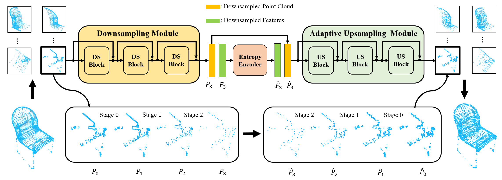

# D-PCC

 [arXiv](http://arxiv.org/abs/2204.12684) | [Project Page](https://yunhe20.github.io/D-PCC) | [Code](https://github.com/yunhe20/D-PCC)

This is the official PyTorch implementation of our paper "Density-preserving Deep Point Cloud Compression" (CVPR 2022).



## Abstract

Local density of point clouds is crucial for representing local details, but has been overlooked by existing point cloud compression methods. To address this, we propose a novel deep point cloud compression method that preserves local density information. Our method works in an auto-encoder fashion: the encoder downsamples the points and learns point-wise features, while the decoder upsamples the points using these features. Specifically, we propose to encode local geometry and density with three embeddings: density embedding, local position embedding and ancestor embedding. During the decoding, we explicitly predict the upsampling factor for each point, and the directions and scales of the upsampled points. To mitigate the clustered points issue in existing methods, we design a novel sub-point convolution layer, and an upsampling block with adaptive scale. Furthermore, our method can also compress point-wise attributes, such as normal. Extensive qualitative and quantitative results on SemanticKITTI and ShapeNet demonstrate that our method achieves the state-of-the-art rate-distortion trade-off.

## Installation

* Install the following packages

```
python==3.7.12
torch==1.7.1
CUDA==11.0
numpy==1.20.3
open3d==0.9.0.0
einops==0.3.2
scikit-learn==1.0.1
compressai
pickle
argparse
```

* Install the built-in libraries

```
cd models/Chamfer3D
python setup.py
cd ../pointops
python setup.py
```

These commands are tested on an ubuntu 16.04 system.

## Data Preparation

First download the [ShapeNetCore](https://shapenet.org/download/shapenetcore) v1 and [SemanticKITTI](http://semantic-kitti.org/dataset.html#download) datasets, and then divide them into non-overlapping blocks.

* ShapeNet

```
# install the `Manifold' program
cd ./dataset
git clone https://github.com/hjwdzh/Manifold
cd Manifold && mkdir build
cd build 
cmake .. -DCMAKE_BUILD_TYPE=Release
make 
cd ..

# divide into blocks
python prepare_shapenet.py --date_root path/to/shapenet
```

* SemanticKITTI

```
python prepare_semantickitti.py --data_root path/to/semantickitti
```

Please refer to the associated code files for the detailed usages and meanings of other arguments (e.g. `cube_size`, `max_num`, etc), and you can adjust them by yourself.

The final file structure is shown as follow:

```
data  
└───semantickitti
│   │   semantickitti_test_xxx.pkl 
│   │   semantickitti_train_xxx.pkl
│   │   semantickitti_val_xxx.pkl
└───shapenet
│   │   mesh # watertight meshes or cad models
│   │   pcd # sampled point clouds
│   │   shapenet_test_xxx.pkl
│   │   shapenet_train_xxx.pkl
│   │   shapenet_val_xxx.pkl
│   │   test.txt
│   │   train.txt
│   │   val.txt
```

## Train

* Position Compression

```
# shapenet
python train.py --dataset shapenet
# semantickitti
python train.py --dataset semantickitti
```

* Normal Compression

```
# shapenet
python train.py --dataset shapenet --compress_normal True
# semantickitti
python train.py --dataset semantickitti --compress_normal True
```

You can manually adjust the `bpp_lambda`, `downsample_rate` and `quantize_latent_xyzs` arguments to achieve different compression ratios, please refer to the `./args/semantickitti_args.py` and `./args/shapenet_args.py` files for the details, and we also give some examples below.
The output files will be saved at `./output/experiment_id/ckpt` by default.

```
# to increase the compression ratio, you can try either of the following commands
python train.py --dataset shapenet --bpp_lambda 1e-2
python train.py --dataset shapenet --downsample_rate 0.25 0.33 0.33
# you can also adjust both bpp_lambda and downsample_rate arguments

# to decrease the compression ratio, you can try any of the following commands
python train.py --dataset shapenet --bpp_lambda 1e-4
python train.py --dataset shapenet --downsample_rate 0.5 0.33 0.33
python train.py --dataset shapenet --quantize_latent_xyzs False
# you can also adjust multi-arguments simultaneously
```

## Test

* Position Compression

```
# shapenet
python test.py --dataset shapenet --model_path path/to/model
# semantickitti
python test.py --dataset semantickitti --model_path path/to/model
```

* Normal Compression

```
# shapenet
python test.py --dataset shapenet --compress_normal True --model_path path/to/model
# semantickitti
python test.py --dataset semantickitti --compress_normal True --model_path path/to/model
```

The decompressed patches and full point clouds will also be saved at `./output/experiment_id/pcd` by default.

## Acknowledgments

Our code is built upon the following repositories: [DEPOCO](https://github.com/PRBonn/deep-point-map-compression), [PAConv](https://github.com/CVMI-Lab/PAConv), [Point Transformer](https://github.com/qq456cvb/Point-Transformers) and [MCCNN](https://github.com/viscom-ulm/MCCNN), thanks for their great work.

## Citation

If you find our project is useful, please consider citing:

```
@InProceedings{He_2022_CVPR,
    author    = {He, Yun and Ren, Xinlin and Tang, Danhang and Zhang, Yinda and Xue, Xiangyang and Fu, Yanwei},
    title     = {Density-preserving Deep Point Cloud Compression},
    booktitle = {Proceedings of the IEEE/CVF Conference on Computer Vision and Pattern Recognition (CVPR)},
    year      = {2022}
}
```
